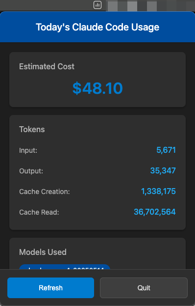

# ccusage-menubar


A menubar app for monitoring Claude Code usage using [ccusage](https://github.com/ryoppippi/ccusage) and [menubar](https://github.com/max-mapper/menubar).



## Installation

### Using npm/npx
```bash
npx github:sters/ccusage-menubar
```

### Using bun/bunx
```bash
bunx github:sters/ccusage-menubar
```

### Local installation
```bash
git clone https://github.com/sters/ccusage-menubar
cd ccusage-menubar
npm install
npm start
```

## Development
```bash
npm run dev
```

## Build
```bash
npm run build
```

## Credits

icon by <a href="https://www.flaticon.com/free-icons/metric" title="metric icons">Metric icons created by Tanah Basah - Flaticon</a>
